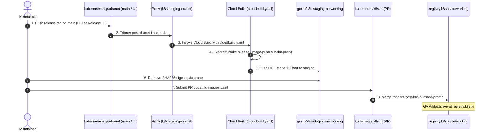

# Repository Maintenance & Release Guide

This document serves as the canonical reference for repository maintenance,
external infrastructure links, and the complete end-to-end release and promotion
process.

---

## Quick Reference: External Dashboards & Repositories

| Service / Resource | External Dashboard / Exact Configuration Link | Purpose |
| :--- | :--- | :--- |
| **TestGrid DRANET Suite** | [TestGrid `sig-network-dranet`](https://testgrid.k8s.io/sig-network-dranet) | Monitor release build health, historical pass/fail trends, and Cloud Build logs. |
| **TestGrid / Prow Tests Config** | [`jobs/kubernetes-sigs/dranet/` in `test-infra`](https://github.com/kubernetes/test-infra/tree/master/config/jobs/kubernetes-sigs/dranet) | Defines DRANET presubmit and periodic Prow test jobs and their TestGrid tab configurations (`dranet-presubmits.yaml`, `dranet-periodic.yaml`). |
| **GCP Staging Registry UI** | [Google Cloud Artifact Registry (`dranet`)](https://console.cloud.google.com/artifacts/docker/k8s-staging-networking/us/gcr.io/dranet) | View container images pushed by Cloud Build to staging (`gcr.io/k8s-staging-networking/dranet`). |
| **GCP Staging Charts UI** | [Google Cloud Artifact Registry (`charts/dranet`)](https://console.cloud.google.com/artifacts/docker/k8s-staging-networking/us/gcr.io/charts%2Fdranet) | View Helm chart OCI artifacts pushed to staging (`gcr.io/k8s-staging-networking/charts/dranet`). |
| **Prow CI Status** | [Prow Dashboard (`kubernetes-sigs/dranet`)](https://prow.k8s.io/?repo=kubernetes-sigs/dranet) | View live and historical Prow job runs (PR verify jobs and postsubmits). |
| **Prow Release Job Config** | [`k8s-staging-dranet.yaml` in `kubernetes/test-infra`](https://github.com/kubernetes/test-infra/blob/master/config/jobs/image-pushing/k8s-staging-dranet.yaml) | Defines the `post-dranet-image` job and its TestGrid test tab annotations (`testgrid-dashboards`). |
| **Image Promotion Manifest** | [`images.yaml` in `kubernetes/k8s.io`](https://github.com/kubernetes/k8s.io/blob/main/registry.k8s.io/images/k8s-staging-networking/images.yaml) | The target file in `kubernetes/k8s.io` modified via PR to promote images/charts from staging to GA. |
| **Image Promo Job Status** | [TestGrid `post-k8sio-image-promo`](https://testgrid.k8s.io/sig-k8s-infra-k8sio#post-k8sio-image-promo) | Tracks the postsubmit promotion job that copies OCI artifacts to `registry.k8s.io`. |
| **Prow Plugins Config** | [`plugins.yaml` in `kubernetes/test-infra`](https://github.com/kubernetes/test-infra/blob/master/config/prow/plugins.yaml) | Configures active Prow plugins for DRANET (e.g., `release-note`). Example: [kubernetes/test-infra#37006](https://github.com/kubernetes/test-infra/pull/37006). |
| **DRANET Slack Channel** | [`#sig-network-dranet` on Kubernetes Slack](https://kubernetes.slack.com/messages/sig-network-dranet) | Primary Slack channel for DRANET discussions and release announcements. |

---

## Automated Workflows

- **Pull Request & Scheduled Testing**:
  - **GitHub Actions**: Handles day-to-day PR validation, linting, and Kind/BATS
    E2E tests ([`e2e.yml`](./.github/workflows/e2e.yml),
    [`bats.yml`](./.github/workflows/bats.yml),
    [`test.yaml`](./.github/workflows/test.yaml),
    [`helm-lint.yml`](./.github/workflows/helm-lint.yml)), alongside Dependabot
    dependency updates ([`dependabot.yml`](./.github/dependabot.yml)).
  - **Prow Presubmits & Periodics**: Prow runs additional PR verification and
    scheduled periodic test jobs defined under
    [`config/jobs/kubernetes-sigs/dranet/`](https://github.com/kubernetes/test-infra/tree/master/config/jobs/kubernetes-sigs/dranet)
    in `kubernetes/test-infra` (`dranet-presubmits.yaml` and
    `dranet-periodic.yaml`). Test results and logs are reported to the
    [TestGrid `sig-network-dranet`](https://testgrid.k8s.io/sig-network-dranet)
    dashboard.
- **Staging Builds on Every Merge**: After **every merge to `main`** (as well
  as whenever a release tag is pushed), Prow's
  [`post-dranet-image`](https://github.com/kubernetes/test-infra/blob/master/config/jobs/image-pushing/k8s-staging-dranet.yaml)
  postsubmit job automatically executes [`cloudbuild.yaml`](./cloudbuild.yaml)
  -> `make release`. This builds and pushes an updated container image and Helm
  chart to the staging registry (`gcr.io/k8s-staging-networking`).

---

## Website & Documentation Infrastructure

The documentation website ([dranet.sigs.k8s.io](https://dranet.sigs.k8s.io)) is
hosted on Netlify and built from the `site/` directory.

If changes or adjustments are needed in the Netlify site configuration (such as
DNS, permissions, or webhook settings), open an infrastructure request issue
against [`kubernetes/org`](https://github.com/kubernetes/org), referencing an
example ask like
[kubernetes/org#6287](https://github.com/kubernetes/org/issues/6287).

---

## Release & Promotion Process

DRANET releases both a container image and a Helm chart as OCI artifacts,
promoted through the
[Kubernetes Image Promotion Pipeline](https://github.com/kubernetes/k8s.io/blob/main/registry.k8s.io/README.md):

- **Container image**: `registry.k8s.io/networking/dranet:v1.x.y`
- **Helm chart**: `registry.k8s.io/networking/charts/dranet:1.x.y`



### Staging vs. Production Registry Summary

| Artifact | Staging Registry (Cloud Build Output) | Production Registry (GA Promoted) | Version Example |
| :--- | :--- | :--- | :--- |
| **Container Image** | [`gcr.io/k8s-staging-networking/dranet`](https://console.cloud.google.com/artifacts/docker/k8s-staging-networking/us/gcr.io/dranet) | `registry.k8s.io/networking/dranet` | `v1.4.0` |
| **Helm Chart (OCI)** | [`oci://gcr.io/k8s-staging-networking/charts/dranet`](https://console.cloud.google.com/artifacts/docker/k8s-staging-networking/us/gcr.io/charts%2Fdranet) | `oci://registry.k8s.io/networking/charts/dranet` | `1.4.0` |

---

### Push a Release Tag

Releases are tagged directly from the `main` branch (we do not use separate
release branches). You can create and push a tag using the command line on
`main`, or directly through the
**[GitHub Releases UI](https://github.com/kubernetes-sigs/dranet/releases/new)**.

To tag via the command line:

```bash
git checkout main
git pull origin main
git tag -a v1.4.0 -m "Release v1.4.0"
git push origin v1.4.0
```

This triggers the Prow postsubmit job
[`post-dranet-image`](https://github.com/kubernetes/test-infra/blob/master/config/jobs/image-pushing/k8s-staging-dranet.yaml)
in `kubernetes/test-infra`, which invokes Google Cloud Build using
[`cloudbuild.yaml`](./cloudbuild.yaml).

---

### Generate Release Notes

Use the
[`release-notes` CLI tool](https://github.com/kubernetes/release/blob/master/cmd/release-notes/README.md)
to generate release notes from PR descriptions since the previous tag:

```bash
export GITHUB_TOKEN=$(gh auth token)
release-notes \
  --org kubernetes-sigs \
  --repo dranet \
  --branch main \
  --start-rev <Previous revision, e.g. v1.3.0> \
  --skip-first-commit \
  --dependencies=false \
  --end-sha <Commit SHA> \
  --output release-notes.md
```
Review and edit `release-notes.md`.

---

### Cloud Build Produces Staging Artifacts

The Cloud Build job runs `make ensure-helm release`, which builds and pushes
both the multi-architecture container image and the Helm chart package to the
staging registries:
- `gcr.io/k8s-staging-networking/dranet:v1.4.0`
- `oci://gcr.io/k8s-staging-networking/charts/dranet:1.4.0`

---

### Retrieve Artifact Digests

Once the Cloud Build run succeeds on staging (monitor on
[TestGrid `sig-network-dranet`](https://testgrid.k8s.io/sig-network-dranet)),
retrieve the SHA256 digests using
[`crane`](https://github.com/google/go-containerregistry/blob/main/cmd/crane/README.md):

```bash
crane digest gcr.io/k8s-staging-networking/dranet:v1.4.0
crane digest gcr.io/k8s-staging-networking/charts/dranet:1.4.0
```

---

### Promote Artifacts to Production

Open a pull request against
[`kubernetes/k8s.io`](https://github.com/kubernetes/k8s.io) adding both
artifacts to
[`registry.k8s.io/images/k8s-staging-networking/images.yaml`](https://github.com/kubernetes/k8s.io/blob/main/registry.k8s.io/images/k8s-staging-networking/images.yaml):

```yaml
- name: dranet
  dmap:
    "sha256:<IMAGE_DIGEST>": ["v1.4.0"]

- name: charts/dranet
  dmap:
    "sha256:<CHART_DIGEST>": ["1.4.0"]
```

Once the PR is merged, the
[`post-k8sio-image-promo`](https://testgrid.k8s.io/sig-k8s-infra-k8sio#post-k8sio-image-promo)
postsubmit job automatically promotes both artifacts from
`gcr.io/k8s-staging-networking` to `registry.k8s.io/networking`.

---

### Verify the Promotion

Verify that both production artifacts are live and accessible:

```bash
# Verify container image
crane digest registry.k8s.io/networking/dranet:v1.4.0

# Verify Helm chart artifact
crane digest registry.k8s.io/networking/charts/dranet:1.4.0
# or
helm show chart oci://registry.k8s.io/networking/charts/dranet --version 1.4.0
```

---

### Publish GitHub Release & Announce

1. Publish the release notes prepared earlier as a new
   [GitHub Release](https://github.com/kubernetes-sigs/dranet/releases/new)
   against the tag.
2. Announce the release in the
   **[`#sig-network-dranet`](https://kubernetes.slack.com/messages/sig-network-dranet)**
   Kubernetes Slack channel or on the
   [SIG Network Mailing List](https://groups.google.com/forum/#!forum/kubernetes-sig-network).
